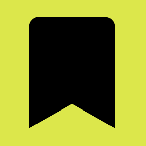
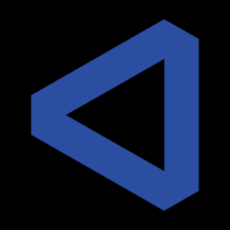
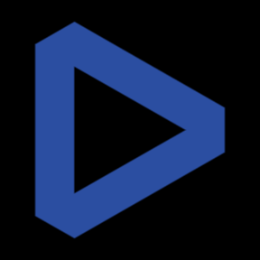
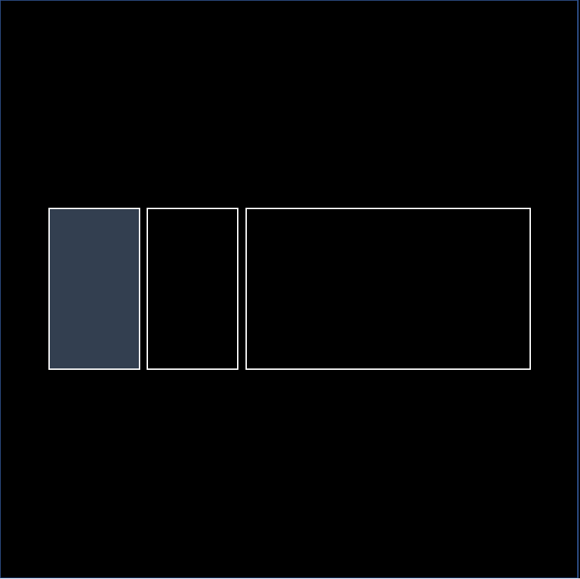
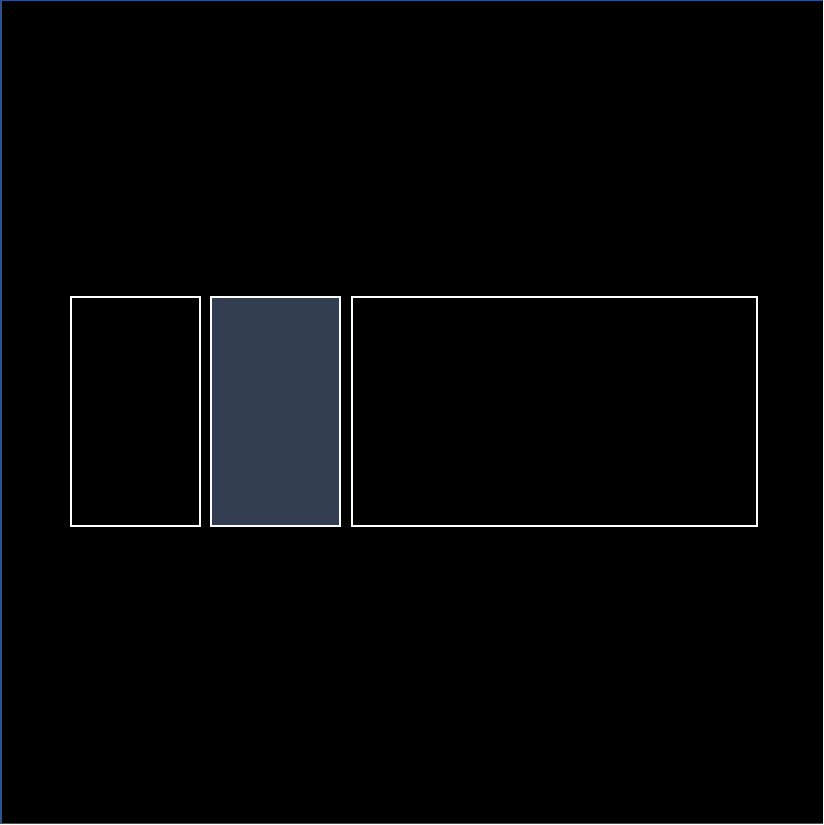
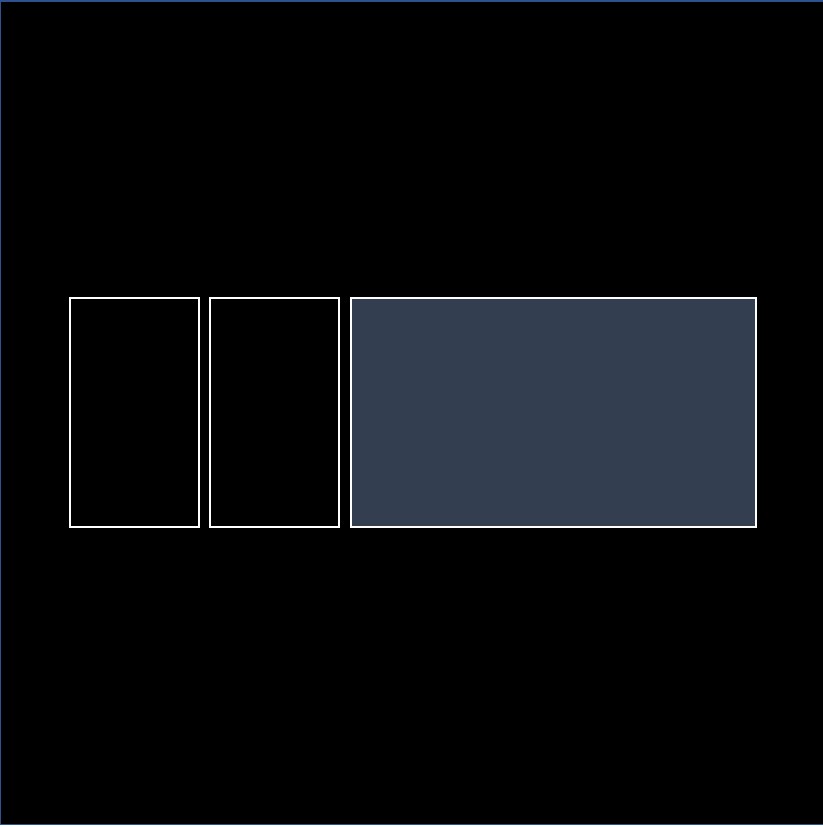

# Stream Deck Icons
A collection of images I use on my Elgato Stream Decks. The icons are categorized into different sections based on use case. Adobe Illustrator files are available for each icon as well.

The 'Acier BAT (Text Solid)' font is used for typography. This font can be found with Adobe Fonts.

## Programming
| Icon | Use/Function | Action |
| ---- | ------------ | ------ |
|  | Trigger a build/rebuild of a project in IntelliJ | Shift + F10 |
|  | Force a hard refresh in a browser to clear cache/etc. | Ctrl + F5 |
|  | Launch "Find in Files" in IntelliJ | Ctrl + Shift + F |
|  | Go to Declaration in IntelliJ | Ctrl + Shift + F1 (custom keymap) |
|  | Launch Firefox Developer Tools | Ctrl + Shift + I |
|  | Input test user (Jack) credentials | Input Username, Tab, Input Password, Enter |
| | Place a bookmark in PyCharm | F11 |

## Video Editing
| Icon | Use/Function | Action |
| ---- | ------------ | ------ |
|  | DaVinci Resolve | Open DaVinci Reoslve |
|  | Switch to "Media" Page | Shift + 2 |
|  | Switch to "Cut" Page | Shift + 3 |
|  | Switch to "Edit" Page | Shift + 4 |
|  | Switch to "Fusion" Page | Shift + 5 |
|  | Switch to "Color" Page | Shift + 6 |
|  | Switch to "Fairlight" Page | Shift + 7 |
|  | Switch to "Deliver" Page | Shift + 8 |
|  | Split clip | Ctrl + \ |

## Windows
| Icon | Use/Function | Action |
| ---- | ------------ | ------ |
|  | Move to the previous (left) Windows desktop | Ctrl + Win + Left Arrow |
|  | Move to the next (right) Windows desktop | Ctrl + Win + Right Arrow |
| | Move to the previous (left) Windows desktop (ALT) | Ctrl + Win + Left Arrow |
| | Move to the next (right) Windows desktop (ALT) | Ctrl + Win + Right Arrow |
|  | Open Enpass (Windows application) | Open Enpass |
|  | Up | Up Arrow |
|  | Down | Down Arrow |
| | Layout 1 (Left 3rd) | Drops window into first section of layout 1 |
| | Layout 1 (Left 3rd) | Drops window into second section of layout 1 |
| | Layout 1 (Left 3rd) | Drops window into third section of layout 1 |

## Web Pages
| Icon | Web Page |
| ---- | -------- |
|  | MYCF Crew |
|  | Font Awesome |
|  | Google Cloud Platform (GCP) |
|  | GitHub |
|  | Jenkins |
|  | Jira |
|  | SonarCloud |
